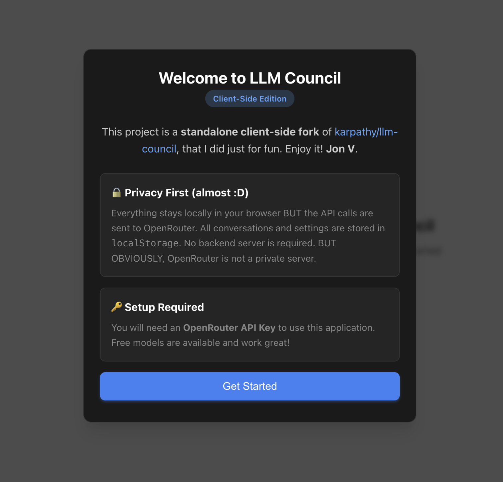
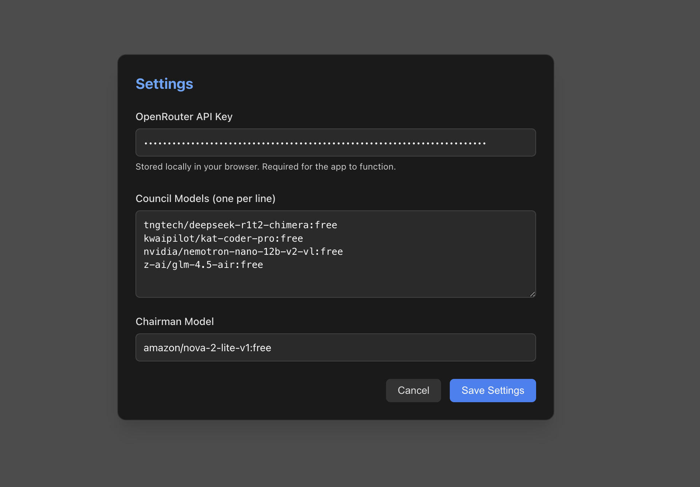
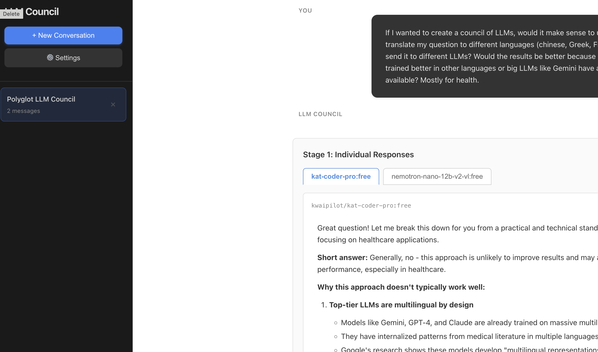

# LLM Council (Client-Side Edition)

A backend-free, client-side only version of the [LLM Council](https://github.com/karpathy/llm-council).

**LLM Council** orchestrates a "council" of AI models to answer your questions. It queries multiple LLMs in parallel (Stage 1), asks them to peer-review and rank each other's responses (Stage 2), and then synthesizes a final, comprehensive answer using a Chairman model (Stage 3).

## Features

- **Local & Private**: Runs entirely in your browser. No backend server required.
- **Data Persistence**: Conversations and Settings are stored securely in your browser's `localStorage`.
- **Model Flexibility**: Configure any models available via [OpenRouter](https://openrouter.ai/).
- **Resilient**: Handles API rate limits automatically with smart retries.
- **Mobile Responsive**: Works seamlessly on desktop and mobile devices.

## Screenshots

### Welcome Screen


### Settings Configuration


### Chat Interface


## Setup

1.  **Clone the repository**:
    ```bash
    git clone https://github.com/jonromero/llm-council-in-the-browser.git
    cd llm-council-in-the-browser
    ```

2.  **Install dependencies**:
    ```bash
    npm install
    ```

3.  **Run the development server**:
    ```bash
    npm run dev
    ```

4.  **Open in Browser**:
    Navigate to `http://localhost:5173` (or the URL shown in your terminal).

5.  **Configure your API Key**:
    - On first launch, you'll see a welcome screen
    - Click through to Settings
    - Enter your [OpenRouter API Key](https://openrouter.ai/keys)
    - Configure your preferred models

## Configuration

1.  Click the **Settings** (⚙️) button in the sidebar.
2.  Enter your **OpenRouter API Key** (get one free at [openrouter.ai](https://openrouter.ai/)).
3.  Configure your **Council Models** (the models that generate initial responses and rank others).
4.  Select a **Chairman Model** (the model that synthesizes the final answer).

## Usage

1.  Start a **New Conversation**.
2.  Type your question and hit enter.
3.  Watch as the Council:
    - **Stage 1**: Collects responses from all Council Models.
    - **Stage 2**: Models rank each other's answers.
    - **Stage 3**: Chairman provides the final synthesis.
4.  **Print Report**: Click the print button to save or print just the final answer.

## Privacy & Data

- **Local Storage**: All conversation history and settings are stored locally in your browser's `localStorage`. No data is sent to any backend server.
- **API Communication**: Your questions and the AI responses are sent to [OpenRouter](https://openrouter.ai/) for processing. Please review [OpenRouter's Privacy Policy](https://openrouter.ai/privacy) for details on how they handle data.
- **API Key Security**: Your OpenRouter API key is stored in your browser's `localStorage` and is only used to authenticate requests to OpenRouter.

## Credits

Based on the original [LLM Council](https://github.com/karpathy/llm-council) by [Andrej Karpathy](https://github.com/karpathy). 

This client-side version was created by [Jon V](https://github.com/jonromero) to run entirely in the browser without requiring a backend server.

## License

MIT License - see the original [LLM Council repository](https://github.com/karpathy/llm-council) for details.
